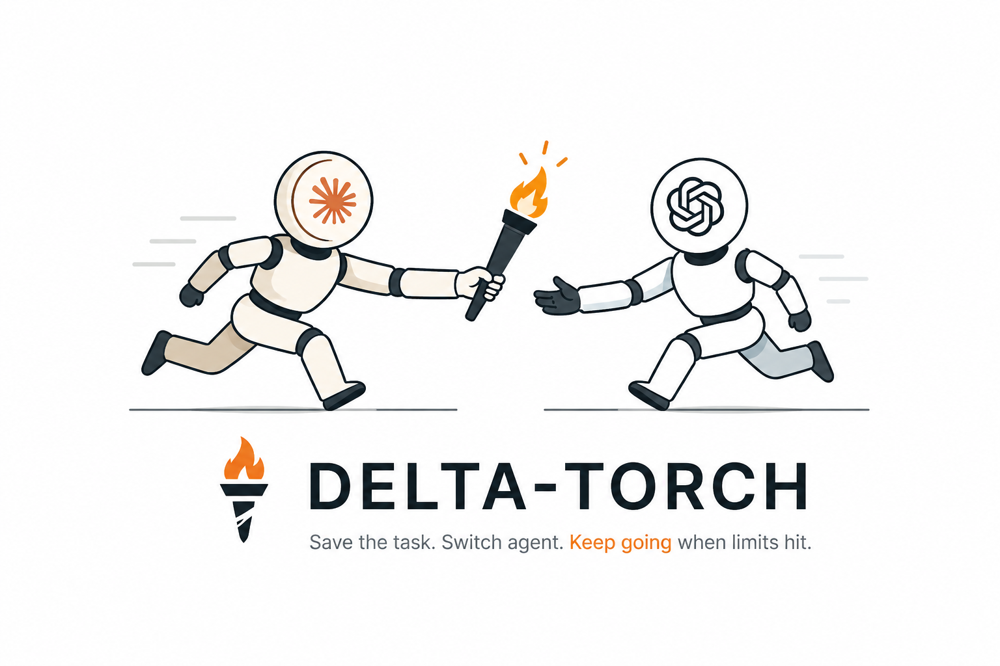

# DeltaTorch



Save the task. Switch agent. Keep going when limits hit.

DeltaTorch is a small handoff skill + CLI for coding sessions that move between agents before context, usage, rate, token, or paid-plan limits stop the work. One agent saves a compact checkpoint. The next agent resumes from that checkpoint instead of redoing the same work or making you copy-paste context.

The goal is simple: save tokens, optimize how you use paid AI-agent plans, and fall back to local or free models when the expensive agent is close to its limit. It also works for planned agent roles: Claude can plan, Codex can implement, Claude can review.

Works with Claude Code, Codex, Copilot, and local agents too. The handoff is just Markdown in `.handoff/`.

[npm](https://www.npmjs.com/package/delta-torch)

## Install

Pick your agent. One command. Done.

| Agent | Install |
| --- | --- |
| Claude Code | `npx skills add MethosPi/delta-torch -a claude-code -y` |
| Codex | `npx skills add MethosPi/delta-torch -a codex -y` |
| GitHub Copilot | `npx skills add MethosPi/delta-torch -a github-copilot -y` |
| Any other | `npx skills add MethosPi/delta-torch -y` |

Install once. After that, the agent should run DeltaTorch itself instead of asking you to copy commands.

## Flow

Start a task with any agent. If that agent gets close to a token, usage, or rate limit, it saves the current task context so another agent can continue from the same point.

You can also split the work intentionally: one agent plans, another executes, and another reviews. The same checkpoint format works for both cases.

1. Start in Claude Code, Codex, Copilot, or a local Ollama-based agent.
2. The agent saves a handoff before it reaches a hard limit, or when you switch phase.
3. Open the next agent and say: `continue task 3`.
4. The next agent runs DeltaTorch, loads the checkpoint, and continues from the saved state.

Same project. Different agent. No restart. Fewer wasted tokens.

## Quick Demo

```bash
$ pnpm dlx delta-torch init
Initialized handoff state in /path/to/project

$ pnpm dlx delta-torch save --reason context-limit <<'EOF'
## Goal
Finish the README positioning.

## Work Completed
Outlined the fallback messaging.

## Next Steps
Resume in Codex and edit the docs.
EOF
Saved task #1 (2026-04-26T12-30-00Z-context-limit)
Continue in another agent with: pnpm dlx delta-torch resume 1
/path/to/project/.handoff/handoffs/2026-04-26T12-30-00Z-context-limit.md

$ pnpm dlx delta-torch resume 1
Task: #1
Checkpoint: 2026-04-26T12-30-00Z-context-limit
File: .handoff/handoffs/2026-04-26T12-30-00Z-context-limit.md

# Agent Handoff

## Goal
Finish the README positioning.

## Next Steps
Resume in Codex and edit the docs.

## Resume Prompt
Continue this task from the saved Agent Handoff checkpoint.
```

## Claude Plans -> Codex Implements -> Claude Reviews

```bash
# Claude Code saves the plan before handing off.
pnpm dlx delta-torch save --reason plan-complete

# Codex resumes the plan and implements.
pnpm dlx delta-torch resume 1

# Codex saves the implementation checkpoint for Claude review.
pnpm dlx delta-torch save --reason ready-for-review
```

The last command prints the next short task number, for example `#2`; Claude Code can resume that checkpoint for review.

## What It Does

- Saves compact task checkpoints in `.handoff/`
- Gives each handoff a short task number like `#3`
- Lets another agent resume by task number, reason, or `latest`
- Saves before visible context, usage, rate, or token-budget limits leave work half-finished
- Helps preserve paid-plan quota by moving suitable work to cheaper or local agents
- Works for intentional planner/executor/reviewer handoffs, not only limit recovery
- Keeps the format simple and audit-friendly
- Avoids secrets from common private paths and token patterns

## CLI

No global install required.

```bash
pnpm dlx delta-torch init
pnpm dlx delta-torch save --reason ready-for-review
pnpm dlx delta-torch resume 3
pnpm dlx delta-torch list
```

If you want the CLI in the repo:

```bash
pnpm add -D delta-torch
```

## File Layout

```text
.handoff/
  config.json
  registry.json
  handoffs/
    2026-04-26T12-30-00Z-context-limit.md
```

Each handoff stores:

- original prompt
- goal
- completed work
- current state
- changed files
- commands run
- risks
- next steps
- a ready-to-use resume prompt

## `.handoff/` Policy

Default recommendation: keep `.handoff/` local and ignored. It is working-session metadata, not source code.

Commit `.handoff/` only when your team intentionally wants shared handoff history in the repository. DeltaTorch does not edit `.gitignore` for you, but its own automatic git snapshot ignores `.handoff/` metadata so checkpoint files do not recursively describe themselves.

## Security Boundaries

DeltaTorch redacts common private paths and token patterns, including `.env` files, private key blocks, bearer tokens, URL credentials, and common secret assignment names.

That is a safety net, not a secret manager. Do not paste API keys, private keys, passwords, `.env` contents, customer data, or other secrets into checkpoint text.

## Notes

- DeltaTorch is not an MCP server, not an orchestrator, and not a daemon.
- Claude Code gets slash-friendly skills. Other agents use the same handoff files and CLI.
- DeltaTorch does not read hidden provider quota telemetry. Agents save proactively from visible warnings, context meters, rate-limit messages, or token budgets you gave them.
- Releases are gated on `v*` tag pushes. Add a [changeset](https://github.com/changesets/changesets) per change with `pnpm changeset`, run `pnpm changeset version` to bump `package.json` and update `CHANGELOG.md`, then push the resulting tag to publish.

## Manual Claude Install

If you want the Claude-only fallback:

```bash
pnpm dlx delta-torch install-skills --target project
```

## License

MIT
